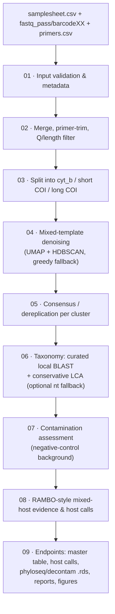

# HÆMA — ONT Blood-Meal Metabarcoding Pipeline

[](https://www.nextflow.io/)
[](https://www.docker.com/)
[](LICENSE)

HÆMA is a reproducible, containerised **Nextflow (DSL2)** pipeline that identifies the
**vertebrate host(s) of *Anopheles gambiae* s.l. blood meals** from Oxford Nanopore (R10.4.1)
multi-marker amplicon data. It is built for **mixed blood meals** — where a mosquito has fed on
more than one host — which traditional Sanger/ELISA methods cannot resolve.

It targets three complementary mitochondrial markers (**cyt b**, **short COI**, **long COI**) and
takes already-basecalled MinKNOW `fastq_pass/barcodeXX` data from validation through to
publication-ready ecological tables and phyloseq objects.

> **Status:** research software, actively developed. Suitable for testing, internal use, and
> external beta. **Not yet** validated for production-scale scientific claims — see
> [Limitations](#limitations) and [`docs/limitations.md`](docs/limitations.md).

---

## What it does



Optional/staged gates are conservative by default: pooled-FASTQ demultiplexing is off unless
requested, and strict production metadata/taxid/taxdump/Bioconductor checks are off until
`-profile production`; an external `nt` BLAST fallback runs only when you supply a database. **Medaka
consensus polishing is on by default** (it needs the pinned ONT Medaka image, pulled once); the tiny
`test` profile turns it off to stay fast. Fallback R outputs and MultiQC are enabled in normal runs,
while the `test` profile disables heavier report steps unless you explicitly turn them back on.

---

## Requirements

| Need | Minimum |
|---|---|
| [Nextflow](https://www.nextflow.io/) | ≥ 24.10.0 |
| Java | 17–24 (Nextflow does not support 25 yet) |
| Container engine | Docker **or** Singularity/Apptainer (recommended); host tools work but aren't reproducible |
| Hardware (test) | 2 cores / 4 GB |
| Hardware (real runs) | 8 cores / 16 GB workstation; scales to HPC |
| GPU | Optional, Medaka only (CPU is the default) |

```bash
# Install Nextflow (if needed)
curl -s https://get.nextflow.io | bash && sudo mv nextflow /usr/local/bin/
nextflow info        # verify Nextflow + a supported Java
```

---

## Quick start — your first successful run

The bundled `test` profile runs on tiny example data shipped in the repo. **No external data,
downloads, or edits required** beyond pulling one small public container.

```bash
git clone <repository-url> haema && cd haema

nextflow run . --help            # all parameters, grouped by category (schema-driven)
nextflow run . --help taxonomy   # drill into one group

# ~1 minute. Validates your install end to end (curated BLAST taxonomy on demo hosts).
nextflow run . -profile test,docker --skip_taxonomy false --outdir results/test
```

Parameters are **validated against the schema on every run** (via the pinned `nf-schema` plugin),
so a mistyped flag is flagged rather than silently ignored. Every run also prints a **Feature
gates** line showing which optional steps are on/off, so the defaults are never a mystery
(see [docs/parameters.md](docs/parameters.md#why-some-defaults-are-false)). The plugin is fetched
once and cached; pre-stage it for offline use (see [docs/reproducibility.md](docs/reproducibility.md)).

You should see `Execution complete` and these files appear:

```text
results/test/05_endpoint_files/bloodmeal_master_endpoint.tsv   # one row per feature, per sample
results/test/05_endpoint_files/host_call_table.tsv             # host calls (incl. mixed_status)
results/test/05_endpoint_files/run_manifest.json               # parameters + provenance
```

On Singularity/Apptainer HPC, swap the engine: `-profile test,singularity`.

---

## Inputs

| Input | Flag | Required | Default |
|---|---|---|---|
| Samplesheet (CSV) | `--input` | **yes** | — (use `-profile test` for the demo) |
| Raw data root | `--raw_data_dir` | **yes** (FASTQ mode) | — |
| Primer file (CSV) | `--primers` | no | `assets/primers.csv` (bundled tri-marker set) |
| Curated reference FASTA | `--reference_fasta` | no | `assets/references/vertebrate_dna_ref_panel.fasta` (bundled) |
| Curated taxonomy sidecar | `--curated_reference_metadata` | no | `assets/references/...taxonomy.tsv` (bundled) |

### Samplesheet

A template is provided at [`assets/samplesheets/example_samplesheet.csv`](assets/samplesheets/example_samplesheet.csv).
Key columns: `run_id`, `barcode_id`, `sample_id`, `sample_type`
(`sample` / `positive_control` / `negative_control`), and ecological/MIEM metadata
(decimal `latitude`/`longitude`, zone, species, batches). `run_id` must match the top-level folder name under
`--raw_data_dir`; `barcode_id` must match the `barcodeXX` folder. Development mode is lenient
about optional metadata; `-profile production` enforces the full MIEM/MIMARKS field set.

### Raw data layout (FASTQ mode)

```text
<raw_data_dir>/<run_id>/<any_minknow_subfolder>/fastq_pass/<barcodeXX>/*.fastq.gz
```

The full parameter reference is in [`nextflow_schema.json`](nextflow_schema.json) and
[`docs/parameters.md`](docs/parameters.md).

---

## Real-data run

```bash
nextflow run . -profile local \
  --input        /path/to/your_samplesheet.csv \
  --raw_data_dir /path/to/Runs \
  --taxonomy_strategy curated_only \
  --python_container haema-python:0.3.0 \   # real UMAP/HDBSCAN denoising (see Containers)
  --enable_rambo_model true \
  --outdir results/myrun --log_dir logs/myrun -resume
```

Pass **absolute paths** for `--input`, `--raw_data_dir`, and any `--reference_fasta` override —
relative paths do not resolve inside containers.

### Execution profiles

Combine one infrastructure profile with optional feature profiles, comma-separated:

| Profile | Purpose |
|---|---|
| `test` | Tiny bundled demo data for a zero-config first run |
| `local` | Local workstation via Docker (laptop-safe resource ceiling) |
| `docker` / `singularity` / `apptainer` | Select the container engine |
| `slurm` | HPC via SLURM + Singularity (shared `NXF_SINGULARITY_CACHEDIR`) |
| `gpu` | Optional NVIDIA GPU acceleration for Medaka (CPU fallback otherwise) |
| `production` | Strict metadata + custom images + full feature set (see below) |

---

## Containers

Public images are **digest-pinned**; nothing uses `:latest`. Three project-specific images cover
stacks no public image provides; the first two are needed by the `production` profile / real
denoising, the third by the (default-on) figure step. Full rationale:
[`docs/CONTAINER_STRATEGY.md`](docs/CONTAINER_STRATEGY.md).

```bash
# Build the custom images (from the repo root):
docker build -t haema-python:0.3.0  -f containers/haema-python/Dockerfile .   # UMAP/HDBSCAN
docker build -t haema-r:0.3.0       -f containers/haema-r/Dockerfile .        # phyloseq/decontam
docker build -t haema-figures:0.3.0 -f containers/haema-figures/Dockerfile .  # matplotlib figures
```

For HPC/publication, push these to a registry and pass their immutable `@sha256:` digests via
`--python_container` / `--r_container` / `--figures_container`.

---

## Outputs

```text
results/
├── 01_ingested/          merged reads + per-sample read stats
├── 02_trimmed_filtered/  primer-trimmed, QC'd, marker-split reads + QC tables
├── 03_consensus_variants/ denoised cluster FASTQs + consensus/ASV features
├── 04_taxonomy/          BLAST DB, raw BLAST hits, per-feature assignments
├── 05_endpoint_files/    ⭐ core downstream tables + phyloseq/decontam .rds + run_manifest.json
├── 06_reports/           HÆMA HTML report, MultiQC, decontam summaries
└── 07_figures/           ⭐ publication figures (pdf/svg/png) + draft captions
pipeline_info/            Nextflow execution timeline, report, trace, DAG
```

The primary deliverable is `05_endpoint_files/bloodmeal_master_endpoint.tsv` (controls preserved
and flagged, never silently dropped) and `host_call_table.tsv` (per sample/marker host calls with
`mixed_status` = `single_host` / `mixed_host`). `06_reports/positive_control_check.tsv` reports
whether each single-host positive control recovered its declared host. `07_figures/` holds
ten publication-ready figures rendered from these tables (see [`docs/figures.md`](docs/figures.md)),
and `05_endpoint_files/ecological_indices.tsv` reports the standard vector–host indices — Human Blood
Index, zoophily, mixed-feeding rate, host diversity (see [`docs/ecological_indices.md`](docs/ecological_indices.md)).
See [`docs/output.md`](docs/output.md) for how to read each file.

> **Scientific caution:** host fractions are abundance **evidence summaries, not validated
> quantitative estimates**, and mixed-host thresholds are not yet benchmarked. The HTML report and
> `run_manifest.json` state this explicitly. See [Limitations](#limitations).

---

## Validate & test (developers)

```bash
make lint                              # python compile, schema, config (8 profiles), refs, unit tests
make test                              # bundled test-profile run (needs Docker)
bash tests/validate_release.sh --run   # full pre-release validation incl. a test run
```

---

## Hardware & runtime expectations

| Run | Cores | RAM | Time | Notes |
|---|---|---|---|---|
| `test` profile | 2 | 4 GB | ~1 min | bundled demo |
| ~8 samples, 5k reads each (real UMAP) | 8 | 14 GB | ~15–30 min | numba JIT recompiles per task |
| Full run / 96 barcodes | HPC | per-process labels | hours | use `-profile slurm` |

Heaviest steps are `DENOISE_MIXED_TEMPLATES` and `MEDAKA_POLISH` (on by default). Resource requests
scale per retry-attempt under a `resourceLimits` ceiling (8 cores / 14 GB locally; raised by
`-profile slurm`). Set `--cleanup true` for large runs to purge work dirs on success (disables
`-resume`).

---

## Troubleshooting

| Symptom | Cause & fix |
|---|---|
| `Cannot find Java ... Java 17 or later (up to 24)` | Java 25+ is unsupported. Install JDK 17–24 and set `JAVA_HOME`. |
| `Missing --input samplesheet CSV` | Provide `--input` (and `--raw_data_dir`), or use `-profile test`. |
| Task fails, `.command.err` shows only a pull log + `Command 'ps' ... cannot be found` | The image lacks `procps`. Use the bundled images or add `procps`. |
| `reference_fasta_exists ... []` in preflight | You passed a **relative** `--reference_fasta`; use an absolute path or the default. |
| Denoising used `greedy_identity` instead of `umap_hdbscan` | Either too few reads (`< mixed_denoise_min_reads_for_umap`) or the default `python:3.11` lacks UMAP — pass `--python_container haema-python:0.3.0`. |
| Hundreds of clusters / very slow taxonomy | Over-splitting on noisy reads — raise `--mixed_denoise_min_cluster_size` / `--mixed_denoise_min_cluster_fraction`. |
| `makeblastdb ... local id is too long` | Fixed in this version (`-parse_seqids` dropped); update if you see it. |

More detail and the failing task's work directory are always printed in the Nextflow error block.

---

## Limitations

This is research software. Headline caveats (full list: [`docs/limitations.md`](docs/limitations.md)):

- Mixed-host **denoising thresholds are not yet benchmarked** against mixed-host positive
  controls; defaults trade minority-host sensitivity for tractability.
- Taxonomy uses a small **curated panel** (≈20 vertebrate mitogenomes) by default; an `nt`
  fallback is optional and user-supplied. Taxids are sourced from the curated sidecar.
- Native BLAST `staxids` and taxdump-LCA require pipe-free accession seqids (the curated panel
  uses descriptive deflines); see [`docs/limitations.md`](docs/limitations.md).
- Barbell/Deepbinner demultiplexing and POD5/Dorado basecalling are **staged/external**, not
  bundled.

Implemented vs staged/planned features are tracked in the feature-status table in
[`docs/limitations.md`](docs/limitations.md#feature-status-implemented-vs-staged).

---

## Reproducibility

Same pipeline revision + pinned containers + `-resume` ⇒ identical results across machines. See
[`docs/reproducibility.md`](docs/reproducibility.md). For an air-gapped/offline or HPC run,
pre-stage images and set `NXF_SINGULARITY_CACHEDIR`.

---

## Citation & license

If you use HÆMA, please cite it (see [`CITATION.cff`](CITATION.cff)). Licensed under the
[MIT License](LICENSE). Contributions welcome — see [`CONTRIBUTING.md`](CONTRIBUTING.md).
